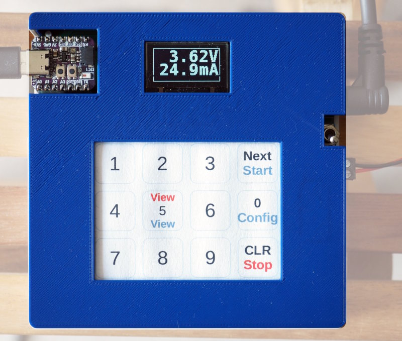

Project circuitpython-vameter
=============================

News
----

  - 02/2024: addes support for logging to SD-card
  - 10/2023: added support for INA260

Overview
--------

This repository contains the necessary CircuitPyhon software to drive a
voltage/current meter based on the following components:

  - INA219 current-sensor breakout or
  - INA260 current-sensor breakout
  - Mini OLED display with 128x64 (based on a SSD1306-chip) or
  - SPI TFT-1.8" display (based on a ST7735R-chip)
  - 4x3 touchpad (based on a MPR121-chip)

Measurements are shown on the display and written as CSV to the
console.

Note that the display and touchpad are not strictly necessary. In
this case (i.e. you only want to measure voltage/current)
you have to change configuration values directly within the source-code.

If you want to use other components (especially a bigger display or
knobs and buttons instead of the touchpad) you should read the
[hacking guide](doc/hacking.md).

Also the main program is agnostic about which kind of sensor is
sampled. Just by providing a data-provider class you can collect data of any
sensor. This is also documented in the [hacking guide](doc/hacking.md).

Hardware
--------

All components use I2C except if you choose to use the SPI-display.
Connect the respective SDA, SCL, Vcc and GND
pins with the relevant pins of the MCU. Don't forget pullups, the builtin
pullups of the MCU are usually too weak.

On the left edge: the MCU, a RP2040-Qt-Trinkey. The INA219 is left to the
barrel-jack on the upper-left side of the breadboard. On the top edge
of the image is a load-resistor. In real applications this resistor is
replaced by the load you want to measure.

The mini-oled with 128x64 pixels is in the middle, on the right is a
MPR121-based keypad with 12 keys. A template for the key-mapping is in
`doc/keypad-template.png` and `doc/keypad-template.odg`.
The latter also has a version for horizontal orientation.

The INA219-breakout has two pins (next to the I2C-interface) and a
screw-terminal for attachement of the power-source (V+) and the load (V-).
**Don't use the pins, use the screw-terminal** or else your results will
be off by about 20%.

The INA260 offers a larger measurment-range than the INA219 (up to 36V/15A
compared to 32V/2A), but is more expensive and the resolution is a
tad worse. See the relevant tutorials and datasheets for details.

Installation (Pico or other MCU)
--------------------------------

Steps:

  0. Install the current version of CircuitPython to your device

  1. Install the following libraries from the CircuitPython library-bundle to
     the `lib`-directory of your device  

       - adafruit_bitmap_font
       - adafruit_displayio_ssd1306
       - adafruit_st7735r
       - adafruit_display_shapes
       - adafruit_display_text
       - adafruit_ina219
       - adafruit_ina260
       - adafruit_register
       - adafruit_mpr121
       - add adafruit_espatcontrol
       - adafruit_requests
       - asyncio  

     The preferred way to do this is to use `circup` (note that the device
     must be mounted):  

         sudo apt-get -y install pip3
         sudo pip3 install circup
         circup --path /mountpoint/of/device install -r requirements.txt

  2. Clone the repository

  3. Configure the software for your board and preferences. See
     [Configuration](#configuration) below.

  4. Check `src/lib/INA219DataProvider.py` for the correct voltage range.
     The code uses the library-default of 32V/2A, but this can be changed
     to 16V/1A or 16V/400mA. The additional precision is probably not
     worth the effort. Also, you can change the chip-internal oversampling
     of the ADC. The Default uses 8x oversampling resulting in a minimal
     sampling time of 4.26ms. Defaults for the INA260 are in
     `src/lib/INA260DataProvider.py`

  5. Copy all files from below `src` to your device.

Installation (Raspberry Pi)
---------------------------

There is a native build of CircuitPython for the Raspberry Pi, but that
build is extremely slow and not usable yet. The better option is to
use _Blinka_, an emulation layer which provides classes and methods usually
missing in a native python installation. Blinka runs on various SBCs,
the Raspberry Pi is only the most prominent example.

You can install the project on a Raspberry Pi (or any other Debian-based SBC
with Blinka-support) using:

    sudo tools/install-pi

This installs the project files, Blinka and all necessary libraries to
`/usr/local/cp-vameter`. To run the program, just use the command
`cp-vameter`. This assumes that `/usr/local/bin` is within your path.

Note that the installation is quite slow, because the install-command
installs everything to a python-virtenv. Especially download, compile
and install of numpy takes a lot of time, even on the faster Pis. For
running the program, a Pi-Zero is more than sufficient.

Also note that Blinka currently only supports SPI-displays with 16-bit
colors.

Configuration
-------------

Configuration is done using variables from three different files:

  - `src/def_config.py`: default values
  - `src/<board_id>/board_config.py`: board-specific overrides
  - `src/user_config.py`: user-specific overrides

This repository has support-files for a number of platforms. If you use
a different MCU and that MCU does not provide the default pins, you should
create a directory `src/<board_id>` with a file `board_config.py`. Please
also create a pull-request in this case. `<board_id>` is the value
of `board.board_id` which you can query in the REPL after importing
the board-module.

The user-specific configuration file `src/user_config.py` is not part
of the repository. Copy `src/def_config.py` and keep only variables
you actually change.

Usage
-----

The program is in three modes: _ready_ (after power-on and reset),
_active_ and _config_. Possible transitions are _ready-active-ready_ and
_ready-config-ready_.

If no keypad is detected, the program runs exactly once using the
defaults defined in the configuration files.

To switch modes, use the keypad:

Keys in blue are valid for the ready-mode, keys in black during configuration
and keys in red during the active-mode.

If you run the program on a SBC using the Blinka-emulation, you can
also provide settings via commandline parameters. For a list of options
run

    cp-vameter -h

This is especially useful for headless operation, i.e. without display
and without keypad.

Ready-Mode
----------

The ready-mode displays the last measurement-results (switch by using the
"View"-button):

 

Use the "Start" or "Config"-buttons to start a measurement or to enter
configuration mode.

Config-Mode
-----------

Once the program is in configuration mode, you can enter various parameters:

  - **Int-Scale**: the scale of the sampling interval in ms/s/m/h/d  
    The values 1-5 on the keypad are mapped to these intervals
  - **Interval**: the sampling interval in the given scale  
    
  - **Duration**: the duration of the measurement. A value of zero
    will run the measurement until it is explicitly or implicitly stopped.
    The scale of the duration depends on the scale of the interval. E.g. a
    interval-scale of 'ms' (i.e. in milliseconds) will force a duration
    measured in seconds. For an interval-scale of 's' the duration-scale will
    be in minutes and so on.  
    
  - **Update**: update-interval of the screen in milliseconds. These updates
    slow down the sampling, so make sure this value is much larger than the
    value of `interval`. Setting the value to zero will disable
    updates of the display during measurement.  
    

The "Next"-button will navigate through the configuration screens, after the
last item the system switches back to ready-mode.

Active-Mode
-----------

During active-mode the program continuously reads the sensor and collects
and displays data. Actual sampling starts as soon as the voltage and
current is above a default threshold (1V/0.5mA) and stops again once

  - the values drop again below these limits, or
  - the configured measurement duration is reached or
  - you press the "Stop"-button

Using the "View"-button you cycle through various views:

  - voltage and current  
    
  - elapsed time  
    
  - plot-view of voltage  
    
  - plot-view of current  
    

Tips and Tricks
---------------

The default configuration of the sensor uses 8x oversampling for the
internal ADC. This reduces noise. Sampling-time according to the
datasheet is 4.26ms. Using less oversampling or less precision you
can bring this down to below 1ms, but if you really need high-frequency
sampling in this range you should think about reimplementing the project
using an optimzed setup and probably C/C++.

Using a Pico, you can reach a minimal sampling interval of about 9.5ms
(about 5.4ms measured on a Pi3B+, about 6.6ms on a QT Py ESP32-S2).

Display-updates take about 330ms. During update, you loose all samples.
*Setting the update-interval to zero prevents data-loss*, but you
can't see the values during measurement. When the
sampling-interval is larger than 330ms, no data-loss occurs regardless
of display-updates.

During active measurement, the default setup not only displays the
values, but also plots of the data. This is also costly (in speed
and memory) and can be disabled in `src/user_config.py` with the constant
`DEF_PLOTS`.

Note that the plots _don't_ show all measured values, but only the values
during display-updates. I.e. the plots just show the values from the
normal value-view across time. If you sample at 100ms and the display
update is every second, you will see every tenth value.

For ex-post data-visualization, save the data from the serial output
to a file and then use the
[Python Datamonitor](https://github.com/bablokb/py-datamon) to create
a plot. A ready to use configuration-file is in
[doc/cp-vameter.json](./cp-vameter.json).

The INA219 provides voltage, current and power. The default configuration
does not sample power. If you need all three values, you can change
this within `lib/INA219DataProvider` (set `WITH_POWER=True`).

In this file you can also change some additional settings, e.g. sample
frequency and voltage/current range as well as the cutoff-values used
for detecting start and stop of measurements.

Logging via WLAN is possible with an additional ESP-01 MCU connected
to the UART of the Pico. For details, read the
[ESP-01 logging HowTo](doc/esp01logger.md).

If the program runs on an ESP32 you can use the builtin wifi for
data-logging. See [ESP32 logging HowTo](doc/esp32logger.md) for details.
Also works with a Pico-W.

You can also log to a file on a SD-card. Add the following line to
your `user_config.py`:

    from SDCardLogger import DataLogger

This is useful for autonomous long-term logging, e.g. when charging a
battery. Tested with a Qt-Py-RP2040 with SD-card BFF. Fastest logging
interval was 7ms.
