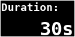
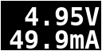

Project circuitpython-vameter
=============================

Overview
--------

This repository contains the necessary CircuitPyhon software to drive a
voltage/current meter based on the following components:

  - INA219 breakout
  - Mini OLED display with 128x64 (based on a SSD1306-chip)
  - 4x3 touchpad (based on a MPR121-chip)

Measurements are shown on the display and written as CSV to the
console.

Note that the display and touchpad are not strictly necessary. In
this case (i.e. you only want to measure voltage/current)
you have to change configuration values directly within the source-code.

If you want to use other components (especially a bigger display or
knobs and buttons instead of the touchpad) you should read the
[porting guide](doc/porting.md).

Hardware
--------

All components use I2C. Connect the respective SDA, SCL, Vcc and GND
pins with the relevant pins of the MCU. Don't forget pullups, the builtin
pullups of the MCU are usually too weak.

On the left edge: the MCU, a RP2040-Qt-Trinkey. The INA219 is left to the
barrel-jack on the upper-left side of the breadboard.

The mini-oled with 128x64 pixels is in the middle, on the right is a
MPR121-based keypad with 12 keys. A template for the key-mapping is in
`doc/keypad-template.png` and `doc/keypad-template.odg`.
The latter also has a version for horizontal orientation but in this case
you have to change the mapping code in `src/lib/Touchpad.py` as well.

The INA219-breakout has two pins (next to the I2C-interface) and a
screw-terminal for attachement of the power-source (V+) and the load (V-).
**Don't use the pins, use the screw-terminal** or else your results will
be off by about 20%.

Installation
------------

Steps:

  1. Clone the repository

  2. Add the following libraries from the CircuitPython library-bundle to
     `src/lib`

    - adafruit_bitmap_font
    - adafruit_displayio_ssd1306
    - adafruit_display_shapes
    - adafruit_display_text
    - adafruit_ina219
    - adafruit_register
    - adafruit_mpr121

  3. If you are using a MCU which does not define board-pins for SDA and
     SCL (e.g. Raspberry Pi Pico): change the pin-values in `src/main.py`.

  4. Check `sr/lib/INA219DataProvider.py` for the correct voltage range.
     The code uses the library-default of 32V/2A, but this can be changed
     to 16V/1A or 16V/400mA. The additional precision is probably not
     worth the effort. Also, you can change the chip-internal oversampling
     of the ADC. The Default uses 8x oversampling resulting in a minimal
     sampling time of 4.26ms.

  5. Copy all files from `src` to your device.

Usage
-----

The program is in three modes: _ready_ (after power-on and reset),
_active_ and _config_. Possible transitions are _ready-active-ready_ and
_ready-config-ready_.

To switch modes, use the keypad:

Keys in blue are valid for the ready-mode, keys in black during configuration
and keys in red during the active-mode.

Ready-Mode
----------

The ready-mode displays the last measurement-results (switch by using the
"View"-button):

 

Use the "Start" or "Config"-buttons to start a measurement or to enter
configuration mode.

Config-Mode
-----------

Once the program is in configuration mode, you can enter various parameters:

  - **Interval**: the sampling interval in milliseconds  
    
  - **Oversample**: oversampling on application level. Since the chip itself
    does oversampling as well, this setting can be left at '1X'  
    
  - **Duration**: the duration of the measurement in seconds. A value of zero
    will run the measurement until it is explicitly or implicitly stopped.  
    
  - **Update**: update-interval of the screen in milliseconds. These updates
    slow down the sampling, so make sure this value is much larger than the
    value of `interval`.  
    

The "Next"-button will navigate through the configuration screens, after the
last item the system switches back to ready-mode.

Active-Mode
-----------

During active-mode the program continuously reads the sensor and collects
and displays data. Actual sampling starts as soon as the voltage and
current is above a default threshold (1V/0.5mA) and stops again once

  - the values drop again below these limits, or
  - the configured measurement duration is reached or
  - you press the "Stop"-button

Using the "View"-button you cycle through various views:

  - voltage and current  
    
  - elapsed time  
    
  - plot-view of voltage  
    
  - plot-view of current  
    
