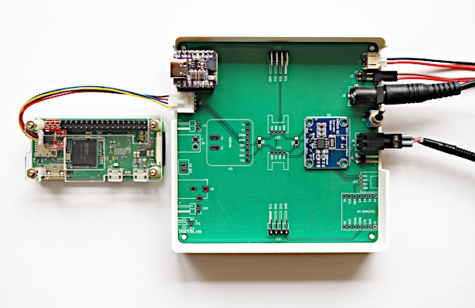

A PCB for the INA219 and INA260
===============================

In this directory you will find the KiCAD-files for a 10x10cm pcb
for the INA219 and the INA260. The latter is untested, since it
is currently not available. The pcb is symetrical, i.e. you either
add components for the INA219 (top-left, top and middle right) or
for the INA260.

The connectors on the top and bottom are for the OLED and the keypad.
Alternatively, you could add Grove-connectors.
You also have to solder the two pullup-resistors in the middle.

The image shows a pcb with INA219. On the left you _either_ connect
a suitable mcu (see below) on the top-left, _or_ you connect an external
mcu (or Pi) using an I2C-Grove-connector. In the image you can see
both options.

On the right side, you have three power inputs for the load (use only one):

  - a JST-PH2 connector for LiPos
  - DuPont jumper pins
  - a 5.5/2.1mm barrel jack

Below the power switch are two power connectors (connect one of them to
to the load):

  - an AKL-182 socket
  - DuPont jumper pins

The AKL-182 socket takes AKL-169 plugs. I use these with various adapter
wires, equiped e.g. with micro-USB, USB-C, JST-PH2 on the other end.

As an alternative, you could use plain 3.5mm screw-terminals.

The pcb was ordered using JLCPCB.

Supported MCUs
--------------

The driving MCU can be added to the board if it uses the XIAO-standard.
Possible alternatives:

  - Adafruit QT Py RP2400
  - Adafruit QT Py ESP32-S2
  - Seeedstudio XIAO RP2400

The form-factor alone is not sufficient, the MCU must also have enough
RAM/flash to support the application.
